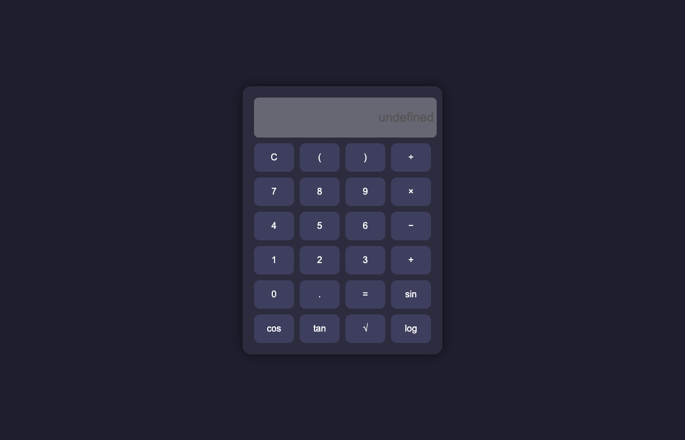

## BUG-005: Evaluating Empty Display Shows "undefined" Instead of Error or Empty

| Field             | Detail                                                                                                     |
| ----------------- | ---------------------------------------------------------------------------------------------------------- |
| **Severity**      | Medium                                                                                                     |
| **Priority**      | P2                                                                                                         |
| **Status**        | Open                                                                                                       |
| **Type**          | Functional Defect — Unhandled Empty Input State                                                            |
| **Environment**   | Chromium / Firefox / WebKit — macOS / Ubuntu / https://rbihubcodechallenge.github.io/calculator/index.html |
| **Discovered By** | Automated regression suite — TC-BUG-005                                                                    |

### Preconditions

- Calculator page is loaded.
- Display is cleared (click **C**) so it shows an empty string `""`.

### Steps to Reproduce

1. Navigate to `https://rbihubcodechallenge.github.io/calculator/index.html`
2. Click **C** to ensure display is empty
3. Click **=** (evaluate) without entering any input

### Expected Result

Display shows **`Error`** or remains **empty** — the calculator must handle empty input gracefully
and communicate a meaningful state to the user.

### Actual Result

Display shows **`undefined`** — JavaScript's raw `undefined` value is written into the display
field, exposing internal evaluation state to the end user.

**Root Cause (Code Analysis):**
The `evaluateExpression()` function (obfuscated JS) returns `undefined` when the token array
is empty (no guard clause for empty input). The display update path does not sanitise the return
value before writing it, so `display.value = undefined` is coerced to the string `"undefined"`.

```
evaluateExpression([]) → undefined
display.value = String(undefined) → "undefined"
```

### Banking Domain Impact

In a banking or financial context, displaying `"undefined"` in a numeric input field can:

- **Confuse users** — "undefined" is a JavaScript artefact with no meaning to non-technical users
- **Indicate poor input validation** — banks require robust boundary handling; this signals low
  software maturity to auditors and QA reviewers
- **Fail compliance checks** — financial UIs must present deterministic, meaningful states at all
  times; undefined output violates display contract requirements

### Evidence

- **Automated test:** `src/tests/regression/bugs.spec.ts` → `TC-BUG-005` (FAILS against current implementation)
- **Screenshot:** `reports/bugs/screenshots/BUG-005-empty-equals-undefined.png`



### Suggested Fix

Add an empty-input guard in the expression evaluator:

```javascript
function evaluateExpression(tokens) {
  if (!tokens || tokens.length === 0) return 'Error';
  // ... existing evaluation logic
}
```
